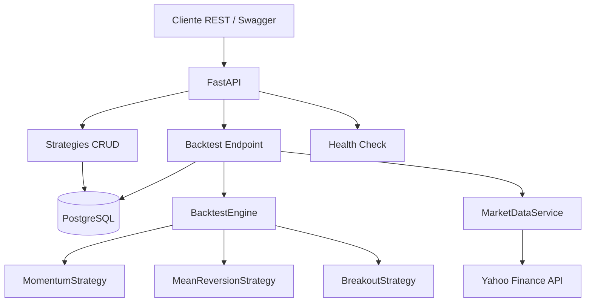
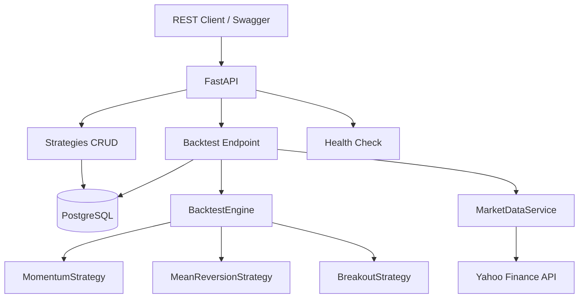

# Quantitative Trading Engine

API REST para backtesting de estrategias quantitativas de trading, construida com FastAPI e PostgreSQL.

[Portugues](#portugues) | [English](#english)

---

## Portugues

### Sobre

Plataforma de backtesting quantitativo que permite criar, gerenciar e testar estrategias de trading sobre dados historicos de mercado. O sistema busca dados do Yahoo Finance, executa simulacoes de trading e persiste os resultados em PostgreSQL.

### Funcionalidades

- **3 estrategias de trading**: Momentum (cruzamento de medias moveis), Mean Reversion (RSI + Bollinger Bands) e Breakout (rompimento de canais)
- **Motor de backtest**: Simulacao com comissoes, slippage, dimensionamento de posicao e calculo de metricas (Sharpe, Sortino, max drawdown, win rate, profit factor)
- **API CRUD completa**: Criar, listar, atualizar e excluir estrategias; executar backtests e consultar resultados
- **Dados de mercado**: Integracao com Yahoo Finance para dados historicos OHLCV
- **Persistencia**: PostgreSQL para estrategias e resultados de backtests

### Arquitetura



### Estrutura do Projeto

```
quantitative-trading-engine/
├── app/
│   ├── api/
│   │   ├── backtest.py          # Endpoints de backtest (POST, GET, GET by ID)
│   │   ├── health.py            # Health check
│   │   └── strategies.py        # CRUD de estrategias
│   ├── core/
│   │   ├── config.py            # Configuracoes (pydantic-settings)
│   │   └── database.py          # Engine e sessao SQLAlchemy
│   ├── models/
│   │   └── strategy.py          # Modelos SQLAlchemy (Strategy, Backtest, Trade)
│   ├── schemas/
│   │   └── strategy.py          # Schemas Pydantic (request/response)
│   ├── services/
│   │   ├── backtest.py          # Motor de backtesting
│   │   └── market_data.py       # Servico de dados de mercado (yfinance)
│   ├── strategies/
│   │   ├── base.py              # Classe abstrata BaseStrategy
│   │   ├── momentum.py          # Cruzamento de medias moveis
│   │   ├── mean_reversion.py    # RSI + Bollinger Bands
│   │   └── breakout.py          # Rompimento de canal de precos
│   └── main.py                  # Aplicacao FastAPI
├── tests/
│   └── unit/
│       ├── test_strategies.py   # Testes das 3 estrategias
│       ├── test_backtest.py     # Testes do motor de backtest
│       └── test_health.py       # Testes do health check
├── examples/
│   └── simple_backtest.py       # Exemplo de uso standalone
├── docs/
│   └── architecture.mmd         # Diagrama Mermaid
├── docker-compose.yml           # API + PostgreSQL
├── Dockerfile
├── requirements.txt             # Dependencias de producao
├── requirements-dev.txt         # Dependencias de desenvolvimento
└── README.md
```

### Endpoints da API

| Metodo | Rota | Descricao |
|--------|------|-----------|
| `GET` | `/health` | Health check |
| `POST` | `/api/v1/strategies/` | Criar estrategia |
| `GET` | `/api/v1/strategies/` | Listar estrategias |
| `GET` | `/api/v1/strategies/{id}` | Obter estrategia por ID |
| `PUT` | `/api/v1/strategies/{id}` | Atualizar estrategia |
| `DELETE` | `/api/v1/strategies/{id}` | Excluir estrategia |
| `POST` | `/api/v1/backtest/` | Executar backtest |
| `GET` | `/api/v1/backtest/` | Listar backtests |
| `GET` | `/api/v1/backtest/{id}` | Obter backtest por ID |

### Metricas de Performance

O motor de backtest calcula as seguintes metricas para cada execucao:

| Metrica | Descricao |
|---------|-----------|
| Sharpe Ratio | Retorno ajustado ao risco (anualizado, rf=0) |
| Sortino Ratio | Retorno ajustado ao risco de queda |
| Max Drawdown | Maior queda percentual do pico ao vale |
| Win Rate | Percentual de trades lucrativos |
| Profit Factor | Soma dos lucros / soma das perdas |
| Avg Profit / Avg Loss | Lucro e perda medios por trade |

### Tecnologias

| Tecnologia | Uso |
|------------|-----|
| Python 3.12 | Linguagem principal |
| FastAPI | Framework REST |
| SQLAlchemy 2.0 | ORM |
| PostgreSQL 15 | Banco de dados |
| pandas / numpy | Calculo de sinais e metricas |
| yfinance | Dados historicos de mercado |
| Docker Compose | Orquestracao local |

### Inicio Rapido

```bash
# Clonar o repositorio
git clone https://github.com/galafis/quantitative-trading-engine.git
cd quantitative-trading-engine

# Criar e ativar ambiente virtual
python -m venv venv
source venv/bin/activate  # Windows: venv\Scripts\activate

# Instalar dependencias
pip install -r requirements.txt

# Para desenvolvimento (inclui pytest, black, flake8, mypy)
pip install -r requirements-dev.txt
```

### Execucao

```bash
# Com Docker Compose (API + PostgreSQL)
docker compose up --build

# Ou localmente (requer PostgreSQL rodando)
# Copiar .env.example para .env e ajustar DATABASE_URL se necessario
cp .env.example .env
uvicorn app.main:app --host 0.0.0.0 --port 8000 --reload

# Documentacao interativa disponivel em:
# http://localhost:8000/docs
```

### Testes

```bash
pytest tests/ -v
pytest tests/ --cov=app --cov-report=html
```

### Notas Importantes

- **Banco de dados**: A aplicacao requer PostgreSQL. O `docker-compose.yml` ja inclui um container PostgreSQL configurado.
- **Dados de mercado**: Os dados sao obtidos do Yahoo Finance. A disponibilidade depende do yfinance e da API do Yahoo.
- **Credenciais**: O docker-compose usa credenciais padrao para desenvolvimento. Alterar em producao.

### Autor

**Gabriel Demetrios Lafis**
- GitHub: [@galafis](https://github.com/galafis)
- LinkedIn: [Gabriel Demetrios Lafis](https://linkedin.com/in/gabriel-demetrios-lafis)

### Licenca

MIT License - veja [LICENSE](LICENSE) para detalhes.

---

## English

### About

Quantitative backtesting platform that lets you create, manage, and test trading strategies on historical market data. The system fetches data from Yahoo Finance, runs trading simulations, and persists results in PostgreSQL.

### Features

- **3 trading strategies**: Momentum (moving average crossover), Mean Reversion (RSI + Bollinger Bands), and Breakout (price channel breakout)
- **Backtest engine**: Simulation with commissions, slippage, position sizing, and metrics calculation (Sharpe, Sortino, max drawdown, win rate, profit factor)
- **Full CRUD API**: Create, list, update, and delete strategies; run backtests and query results
- **Market data**: Yahoo Finance integration for historical OHLCV data
- **Persistence**: PostgreSQL for strategies and backtest results

### Architecture



### Project Structure

```
quantitative-trading-engine/
├── app/
│   ├── api/
│   │   ├── backtest.py          # Backtest endpoints (POST, GET, GET by ID)
│   │   ├── health.py            # Health check
│   │   └── strategies.py        # Strategies CRUD
│   ├── core/
│   │   ├── config.py            # Settings (pydantic-settings)
│   │   └── database.py          # SQLAlchemy engine and session
│   ├── models/
│   │   └── strategy.py          # SQLAlchemy models (Strategy, Backtest, Trade)
│   ├── schemas/
│   │   └── strategy.py          # Pydantic schemas (request/response)
│   ├── services/
│   │   ├── backtest.py          # Backtesting engine
│   │   └── market_data.py       # Market data service (yfinance)
│   ├── strategies/
│   │   ├── base.py              # Abstract BaseStrategy class
│   │   ├── momentum.py          # Moving average crossover
│   │   ├── mean_reversion.py    # RSI + Bollinger Bands
│   │   └── breakout.py          # Price channel breakout
│   └── main.py                  # FastAPI application
├── tests/
│   └── unit/
│       ├── test_strategies.py   # Tests for all 3 strategies
│       ├── test_backtest.py     # Backtest engine tests
│       └── test_health.py       # Health check tests
├── examples/
│   └── simple_backtest.py       # Standalone usage example
├── docs/
│   └── architecture.mmd         # Mermaid diagram
├── docker-compose.yml           # API + PostgreSQL
├── Dockerfile
├── requirements.txt             # Production dependencies
├── requirements-dev.txt         # Development dependencies
└── README.md
```

### API Endpoints

| Method | Route | Description |
|--------|-------|-------------|
| `GET` | `/health` | Health check |
| `POST` | `/api/v1/strategies/` | Create strategy |
| `GET` | `/api/v1/strategies/` | List strategies |
| `GET` | `/api/v1/strategies/{id}` | Get strategy by ID |
| `PUT` | `/api/v1/strategies/{id}` | Update strategy |
| `DELETE` | `/api/v1/strategies/{id}` | Delete strategy |
| `POST` | `/api/v1/backtest/` | Run backtest |
| `GET` | `/api/v1/backtest/` | List backtests |
| `GET` | `/api/v1/backtest/{id}` | Get backtest by ID |

### Performance Metrics

The backtest engine calculates the following metrics for each run:

| Metric | Description |
|--------|-------------|
| Sharpe Ratio | Risk-adjusted return (annualized, rf=0) |
| Sortino Ratio | Downside risk-adjusted return |
| Max Drawdown | Largest peak-to-trough percentage decline |
| Win Rate | Percentage of profitable trades |
| Profit Factor | Sum of profits / sum of losses |
| Avg Profit / Avg Loss | Average profit and loss per trade |

### Technologies

| Technology | Usage |
|------------|-------|
| Python 3.12 | Primary language |
| FastAPI | REST framework |
| SQLAlchemy 2.0 | ORM |
| PostgreSQL 15 | Database |
| pandas / numpy | Signal computation and metrics |
| yfinance | Historical market data |
| Docker Compose | Local orchestration |

### Quick Start

```bash
# Clone the repository
git clone https://github.com/galafis/quantitative-trading-engine.git
cd quantitative-trading-engine

# Create and activate virtual environment
python -m venv venv
source venv/bin/activate  # Windows: venv\Scripts\activate

# Install dependencies
pip install -r requirements.txt

# For development (includes pytest, black, flake8, mypy)
pip install -r requirements-dev.txt
```

### Running

```bash
# With Docker Compose (API + PostgreSQL)
docker compose up --build

# Or locally (requires running PostgreSQL)
# Copy .env.example to .env and adjust DATABASE_URL if needed
cp .env.example .env
uvicorn app.main:app --host 0.0.0.0 --port 8000 --reload

# Interactive docs available at:
# http://localhost:8000/docs
```

### Tests

```bash
pytest tests/ -v
pytest tests/ --cov=app --cov-report=html
```

### Important Notes

- **Database**: The application requires PostgreSQL. The `docker-compose.yml` includes a pre-configured PostgreSQL container.
- **Market data**: Data is fetched from Yahoo Finance. Availability depends on yfinance and the Yahoo API.
- **Credentials**: docker-compose uses default development credentials. Change them in production.

### Author

**Gabriel Demetrios Lafis**
- GitHub: [@galafis](https://github.com/galafis)
- LinkedIn: [Gabriel Demetrios Lafis](https://linkedin.com/in/gabriel-demetrios-lafis)

### License

MIT License - see [LICENSE](LICENSE) for details.
