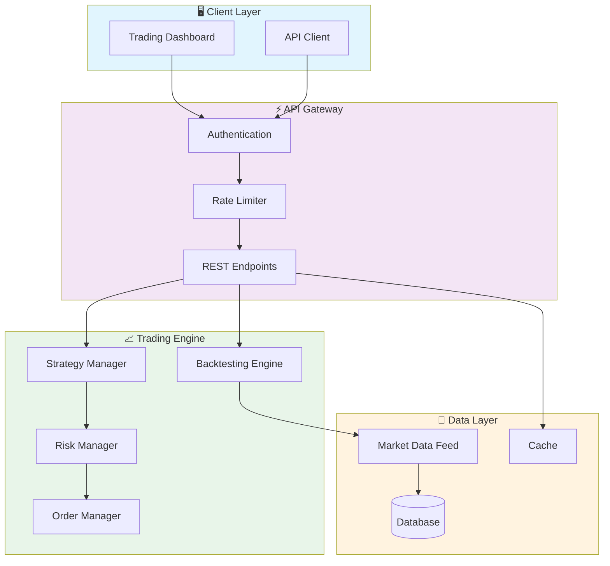
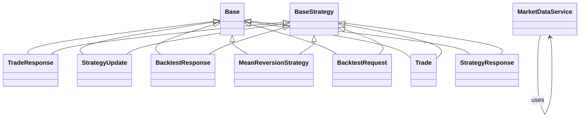

# 📈 Quantitative Trading Engine

> Algorithmic trading platform with backtesting engine, FastAPI REST API, and multiple strategy types (momentum, mean reversion, breakout). Built with Python, PostgreSQL, and Redis.

[](https://img.shields.io/badge/)
[](https://img.shields.io/badge/)
[](https://img.shields.io/badge/)
[](https://img.shields.io/badge/)
[](https://img.shields.io/badge/)
[](https://img.shields.io/badge/)
[](https://img.shields.io/badge/)
[](LICENSE)

[English](#english) | [Português](#português)

---

## English

### 🎯 Overview

**Quantitative Trading Engine** is a production-grade Python application that showcases modern software engineering practices including clean architecture, comprehensive testing, containerized deployment, and CI/CD readiness.

The codebase comprises **1,823 lines** of source code organized across **30 modules**, following industry best practices for maintainability, scalability, and code quality.

### ✨ Key Features

- **📈 Strategy Engine**: Multiple trading strategy implementations with configurable parameters
- **🔄 Backtesting Framework**: Historical data simulation with realistic market conditions
- **📊 Performance Analytics**: Sharpe ratio, Sortino ratio, maximum drawdown, and more
- **⚡ Real-time Processing**: Low-latency data processing optimized for market speed
- **⚡ Async API**: High-performance async REST API with FastAPI
- **📖 Auto-Documentation**: Interactive Swagger UI and ReDoc
- **✅ Validation**: Pydantic-powered request/response validation
- **🐳 Containerized**: Docker support for consistent deployment

### 🏗️ Architecture





### 📡 API Endpoints

| Method | Endpoint | Description |
|--------|----------|-------------|
| `POST` | `/` | Create resource (list/create) |
| `GET` | `/` | Retrieve resource (list/create) |
| `GET` | `/{backtest_id}` | Retrieve {Backtest Id} by ID |
| `GET` | `/health` | Retrieve Health |
| `GET` | `/{strategy_id}` | Retrieve {Strategy Id} by ID |
| `PUT` | `/{strategy_id}` | Update {Strategy Id} by ID |
| `DELETE` | `/{strategy_id}` | Delete {Strategy Id} by ID |

### 🚀 Quick Start

#### Prerequisites

- Python 3.12+
- pip (Python package manager)
- Docker and Docker Compose (optional)

#### Installation

```bash
# Clone the repository
git clone https://github.com/galafis/quantitative-trading-engine.git
cd quantitative-trading-engine

# Create and activate virtual environment
python -m venv venv
source venv/bin/activate  # On Windows: venv\Scripts\activate

# Install dependencies
pip install -r requirements.txt
```

#### Running

```bash
# Run the application
python app/main.py
```

### 🐳 Docker

```bash
# Start all services
docker-compose up -d

# View logs
docker-compose logs -f

# Stop all services
docker-compose down

# Rebuild after changes
docker-compose up -d --build
```

### 🧪 Testing

```bash
# Run all tests
pytest

# Run with coverage report
pytest --cov --cov-report=html

# Run specific test module
pytest tests/test_main.py -v

# Run with detailed output
pytest -v --tb=short
```

### 📁 Project Structure

```
quantitative-trading-engine/
├── app/          # Source code
│   ├── api/           # API endpoints
│   │   ├── __init__.py
│   │   ├── backtest.py
│   │   ├── health.py
│   │   └── strategies.py
│   ├── core/          # Core configuration
│   │   ├── __init__.py
│   │   ├── config.py
│   │   └── database.py
│   ├── models/        # Data models
│   │   ├── __init__.py
│   │   └── strategy.py
│   ├── schemas/       # Validation schemas
│   │   ├── __init__.py
│   │   └── strategy.py
│   ├── services/      # Business logic
│   │   ├── __init__.py
│   │   ├── backtest.py
│   │   └── market_data.py
│   ├── strategies/    # Trading strategies
│   │   ├── __init__.py
│   │   ├── base.py
│   │   ├── breakout.py
│   │   ├── mean_reversion.py
│   │   └── momentum.py
│   ├── utils/         # Utilities
│   │   └── __init__.py
│   ├── __init__.py
│   └── main.py
├── docs/          # Documentation
│   └── images/
├── examples/
│   └── simple_backtest.py
├── tests/         # Test suite
│   ├── integration/
│   │   └── __init__.py
│   ├── unit/
│   │   ├── __init__.py
│   │   ├── test_backtest.py
│   │   ├── test_health.py
│   │   └── test_strategies.py
│   ├── __init__.py
│   └── conftest.py
├── CONTRIBUTING.md
├── Dockerfile
├── LICENSE
├── Makefile
├── README.md
├── docker-compose.yml
└── requirements.txt
```

### 📊 Performance Metrics

The engine calculates comprehensive performance metrics:

| Metric | Description | Formula |
|--------|-------------|---------|
| **Sharpe Ratio** | Risk-adjusted return | (Rp - Rf) / σp |
| **Sortino Ratio** | Downside risk-adjusted return | (Rp - Rf) / σd |
| **Max Drawdown** | Maximum peak-to-trough decline | max(1 - Pt/Pmax) |
| **Win Rate** | Percentage of profitable trades | Wins / Total |
| **Profit Factor** | Gross profit / Gross loss | ΣProfit / ΣLoss |
| **Calmar Ratio** | Return / Max Drawdown | CAGR / MDD |
| **VaR (95%)** | Value at Risk | 5th percentile of returns |
| **Expected Shortfall** | Conditional VaR | E[R | R < VaR] |

### 🛠️ Tech Stack

| Technology | Description | Role |
|------------|-------------|------|
| **Python** | Core Language | Primary |
| **Docker** | Containerization platform | Framework |
| **FastAPI** | High-performance async web framework | Framework |
| **NumPy** | Numerical computing | Framework |
| **Pandas** | Data manipulation library | Framework |
| **PostgreSQL** | Relational database | Framework |
| **SQLAlchemy** | SQL toolkit and ORM | Framework |

### 🚀 Deployment

#### Cloud Deployment Options

The application is containerized and ready for deployment on:

| Platform | Service | Notes |
|----------|---------|-------|
| **AWS** | ECS, EKS, EC2 | Full container support |
| **Google Cloud** | Cloud Run, GKE | Serverless option available |
| **Azure** | Container Instances, AKS | Enterprise integration |
| **DigitalOcean** | App Platform, Droplets | Cost-effective option |

```bash
# Production build
docker build -t quantitative-trading-engine:latest .

# Tag for registry
docker tag quantitative-trading-engine:latest registry.example.com/quantitative-trading-engine:latest

# Push to registry
docker push registry.example.com/quantitative-trading-engine:latest
```

### 🤝 Contributing

Contributions are welcome! Please feel free to submit a Pull Request. For major changes, please open an issue first to discuss what you would like to change.

1. Fork the project
2. Create your feature branch (`git checkout -b feature/AmazingFeature`)
3. Commit your changes (`git commit -m 'Add some AmazingFeature'`)
4. Push to the branch (`git push origin feature/AmazingFeature`)
5. Open a Pull Request

### 📄 License

This project is licensed under the MIT License - see the [LICENSE](LICENSE) file for details.

### 👤 Author

**Gabriel Demetrios Lafis**
- GitHub: [@galafis](https://github.com/galafis)
- LinkedIn: [Gabriel Demetrios Lafis](https://linkedin.com/in/gabriel-demetrios-lafis)

---

## Português

### 🎯 Visão Geral

**Quantitative Trading Engine** é uma aplicação Python de nível profissional que demonstra práticas modernas de engenharia de software, incluindo arquitetura limpa, testes abrangentes, implantação containerizada e prontidão para CI/CD.

A base de código compreende **1,823 linhas** de código-fonte organizadas em **30 módulos**, seguindo as melhores práticas do setor para manutenibilidade, escalabilidade e qualidade de código.

### ✨ Funcionalidades Principais

- **📈 Strategy Engine**: Multiple trading strategy implementations with configurable parameters
- **🔄 Backtesting Framework**: Historical data simulation with realistic market conditions
- **📊 Performance Analytics**: Sharpe ratio, Sortino ratio, maximum drawdown, and more
- **⚡ Real-time Processing**: Low-latency data processing optimized for market speed
- **⚡ Async API**: High-performance async REST API with FastAPI
- **📖 Auto-Documentation**: Interactive Swagger UI and ReDoc
- **✅ Validation**: Pydantic-powered request/response validation
- **🐳 Containerized**: Docker support for consistent deployment

### 🏗️ Arquitetura


### 📡 API Endpoints

| Method | Endpoint | Description |
|--------|----------|-------------|
| `POST` | `/` | Create resource (list/create) |
| `GET` | `/` | Retrieve resource (list/create) |
| `GET` | `/{backtest_id}` | Retrieve {Backtest Id} by ID |
| `GET` | `/health` | Retrieve Health |
| `GET` | `/{strategy_id}` | Retrieve {Strategy Id} by ID |
| `PUT` | `/{strategy_id}` | Update {Strategy Id} by ID |
| `DELETE` | `/{strategy_id}` | Delete {Strategy Id} by ID |

### 🚀 Início Rápido

#### Prerequisites

- Python 3.12+
- pip (Python package manager)
- Docker and Docker Compose (optional)

#### Installation

```bash
# Clone the repository
git clone https://github.com/galafis/quantitative-trading-engine.git
cd quantitative-trading-engine

# Create and activate virtual environment
python -m venv venv
source venv/bin/activate  # On Windows: venv\Scripts\activate

# Install dependencies
pip install -r requirements.txt
```

#### Running

```bash
# Run the application
python app/main.py
```

### 🐳 Docker

```bash
# Start all services
docker-compose up -d

# View logs
docker-compose logs -f

# Stop all services
docker-compose down

# Rebuild after changes
docker-compose up -d --build
```

### 🧪 Testing

```bash
# Run all tests
pytest

# Run with coverage report
pytest --cov --cov-report=html

# Run specific test module
pytest tests/test_main.py -v

# Run with detailed output
pytest -v --tb=short
```

### 📁 Estrutura do Projeto

```
quantitative-trading-engine/
├── app/          # Source code
│   ├── api/           # API endpoints
│   │   ├── __init__.py
│   │   ├── backtest.py
│   │   ├── health.py
│   │   └── strategies.py
│   ├── core/          # Core configuration
│   │   ├── __init__.py
│   │   ├── config.py
│   │   └── database.py
│   ├── models/        # Data models
│   │   ├── __init__.py
│   │   └── strategy.py
│   ├── schemas/       # Validation schemas
│   │   ├── __init__.py
│   │   └── strategy.py
│   ├── services/      # Business logic
│   │   ├── __init__.py
│   │   ├── backtest.py
│   │   └── market_data.py
│   ├── strategies/    # Trading strategies
│   │   ├── __init__.py
│   │   ├── base.py
│   │   ├── breakout.py
│   │   ├── mean_reversion.py
│   │   └── momentum.py
│   ├── utils/         # Utilities
│   │   └── __init__.py
│   ├── __init__.py
│   └── main.py
├── docs/          # Documentation
│   └── images/
├── examples/
│   └── simple_backtest.py
├── tests/         # Test suite
│   ├── integration/
│   │   └── __init__.py
│   ├── unit/
│   │   ├── __init__.py
│   │   ├── test_backtest.py
│   │   ├── test_health.py
│   │   └── test_strategies.py
│   ├── __init__.py
│   └── conftest.py
├── CONTRIBUTING.md
├── Dockerfile
├── LICENSE
├── Makefile
├── README.md
├── docker-compose.yml
└── requirements.txt
```

### 📊 Performance Metrics

The engine calculates comprehensive performance metrics:

| Metric | Description | Formula |
|--------|-------------|---------|
| **Sharpe Ratio** | Risk-adjusted return | (Rp - Rf) / σp |
| **Sortino Ratio** | Downside risk-adjusted return | (Rp - Rf) / σd |
| **Max Drawdown** | Maximum peak-to-trough decline | max(1 - Pt/Pmax) |
| **Win Rate** | Percentage of profitable trades | Wins / Total |
| **Profit Factor** | Gross profit / Gross loss | ΣProfit / ΣLoss |
| **Calmar Ratio** | Return / Max Drawdown | CAGR / MDD |
| **VaR (95%)** | Value at Risk | 5th percentile of returns |
| **Expected Shortfall** | Conditional VaR | E[R | R < VaR] |

### 🛠️ Stack Tecnológica

| Tecnologia | Descrição | Papel |
|------------|-----------|-------|
| **Python** | Core Language | Primary |
| **Docker** | Containerization platform | Framework |
| **FastAPI** | High-performance async web framework | Framework |
| **NumPy** | Numerical computing | Framework |
| **Pandas** | Data manipulation library | Framework |
| **PostgreSQL** | Relational database | Framework |
| **SQLAlchemy** | SQL toolkit and ORM | Framework |

### 🚀 Deployment

#### Cloud Deployment Options

The application is containerized and ready for deployment on:

| Platform | Service | Notes |
|----------|---------|-------|
| **AWS** | ECS, EKS, EC2 | Full container support |
| **Google Cloud** | Cloud Run, GKE | Serverless option available |
| **Azure** | Container Instances, AKS | Enterprise integration |
| **DigitalOcean** | App Platform, Droplets | Cost-effective option |

```bash
# Production build
docker build -t quantitative-trading-engine:latest .

# Tag for registry
docker tag quantitative-trading-engine:latest registry.example.com/quantitative-trading-engine:latest

# Push to registry
docker push registry.example.com/quantitative-trading-engine:latest
```

### 🤝 Contribuindo

Contribuições são bem-vindas! Sinta-se à vontade para enviar um Pull Request.

### 📄 Licença

Este projeto está licenciado sob a Licença MIT - veja o arquivo [LICENSE](LICENSE) para detalhes.

### 👤 Autor

**Gabriel Demetrios Lafis**
- GitHub: [@galafis](https://github.com/galafis)
- LinkedIn: [Gabriel Demetrios Lafis](https://linkedin.com/in/gabriel-demetrios-lafis)
