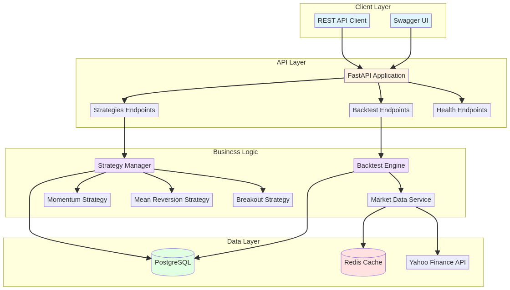

# 📈 Quantitative Trading Engine

[](https://www.python.org/)
[](https://fastapi.tiangolo.com/)
[](https://www.postgresql.org/)
[](https://redis.io/)
[](https://www.docker.com/)
[](LICENSE)
[](#testing)

[English](#english) | [Português](#português)

---

## English

### 🎯 Overview

**Quantitative Trading Engine** is a professional-grade platform for developing, backtesting, and executing algorithmic trading strategies. Built with modern Python technologies, it provides a robust REST API for strategy management, comprehensive backtesting capabilities, and real-time performance analytics.

This platform is designed for quantitative traders, portfolio managers, and financial engineers who need a reliable infrastructure for automated trading systems.

### ✨ Key Features

#### 🔧 Core Functionality
- **Multiple Strategy Types**: Momentum, Mean Reversion, and Breakout strategies out-of-the-box
- **Professional Backtesting Engine**: Statistical validation with Sharpe ratio, Sortino ratio, and maximum drawdown
- **REST API**: Full-featured API with OpenAPI/Swagger documentation
- **Real-time Market Data**: Integration with Yahoo Finance for historical and live data
- **Position Sizing**: Intelligent position sizing based on risk management principles
- **Performance Metrics**: Comprehensive analytics including win rate, profit factor, and trade statistics

#### 🏗️ Architecture
- **Microservices-Ready**: Modular design with clear separation of concerns
- **Database Persistence**: PostgreSQL for reliable data storage
- **Caching Layer**: Redis for high-performance data access
- **Containerized**: Docker and Docker Compose for easy deployment
- **Type-Safe**: Full type hints with Pydantic validation
- **Test Coverage**: Comprehensive unit and integration tests

#### 📊 Trading Strategies

**1. Momentum Strategy**
- Moving average crossover system
- Supports both SMA and EMA
- Configurable fast/slow periods
- Trend-following approach

**2. Mean Reversion Strategy**
- Bollinger Bands with RSI confirmation
- Oversold/overbought detection
- Statistical mean reversion
- Risk-adjusted entries

**3. Breakout Strategy**
- Support/resistance level detection
- Volume confirmation
- Threshold-based breakouts
- False breakout filtering

### 🚀 Quick Start

#### Prerequisites
- Python 3.11+
- Docker and Docker Compose
- PostgreSQL 15+ (or use Docker)
- Redis 7+ (or use Docker)

#### Installation

1. **Clone the repository**
```bash
git clone https://github.com/yourusername/quantitative-trading-engine.git
cd quantitative-trading-engine
```

2. **Create virtual environment**
```bash
python -m venv venv
source venv/bin/activate  # On Windows: venv\Scripts\activate
```

3. **Install dependencies**
```bash
pip install -r requirements.txt
```

4. **Configure environment**
```bash
cp .env.example .env
# Edit .env with your configuration
```

5. **Start with Docker (Recommended)**
```bash
docker-compose up -d
```

The API will be available at `http://localhost:8000`

#### Manual Setup (Without Docker)

1. **Start PostgreSQL and Redis**
```bash
# Make sure PostgreSQL and Redis are running
```

2. **Run the application**
```bash
uvicorn app.main:app --reload
```

### 💡 Quick Start Examples

Check out the `examples/` directory for practical usage examples:

```bash
# Run a simple backtest example
python examples/simple_backtest.py
```

This will demonstrate:
- Fetching historical market data
- Creating a momentum strategy
- Running a backtest
- Analyzing performance metrics

### 📖 API Documentation

Once the application is running, access the interactive API documentation:

- **Swagger UI**: http://localhost:8000/docs
- **ReDoc**: http://localhost:8000/redoc

#### Example API Usage

**Create a Strategy**
```bash
curl -X POST "http://localhost:8000/api/v1/strategies/" \
  -H "Content-Type: application/json" \
  -d '{
    "name": "My Momentum Strategy",
    "description": "Fast momentum strategy for day trading",
    "strategy_type": "momentum",
    "parameters": {
      "fast_period": 10,
      "slow_period": 30,
      "ma_type": "ema"
    },
    "is_active": true
  }'
```

**Run a Backtest**
```bash
curl -X POST "http://localhost:8000/api/v1/backtest/" \
  -H "Content-Type: application/json" \
  -d '{
    "strategy_id": 1,
    "symbol": "^BVSP",
    "start_date": "2023-01-01T00:00:00",
    "end_date": "2023-12-31T23:59:59",
    "initial_capital": 100000,
    "commission": 0.001,
    "slippage": 0.0005
  }'
```

### 🧪 Testing

Run the comprehensive test suite:

```bash
# Run all tests
pytest

# Run with coverage
pytest --cov=app --cov-report=html

# Run specific test file
pytest tests/unit/test_strategies.py

# Run with verbose output
pytest -v
```

### 🏗️ Architecture Diagram



The platform follows a layered architecture with clear separation of concerns:
- **Client Layer**: REST API clients and Swagger UI
- **API Layer**: FastAPI endpoints for strategies, backtesting, and health checks
- **Business Logic**: Strategy implementations and backtesting engine
- **Data Layer**: PostgreSQL for persistence, Redis for caching, Yahoo Finance for market data

### 📁 Project Structure

```
quantitative-trading-engine/
├── app/
│   ├── api/              # API endpoints
│   │   ├── strategies.py
│   │   ├── backtest.py
│   │   └── health.py
│   ├── core/             # Core configuration
│   │   ├── config.py
│   │   └── database.py
│   ├── models/           # Database models
│   │   └── strategy.py
│   ├── schemas/          # Pydantic schemas
│   │   └── strategy.py
│   ├── services/         # Business logic
│   │   ├── backtest.py
│   │   └── market_data.py
│   ├── strategies/       # Trading strategies
│   │   ├── base.py
│   │   ├── momentum.py
│   │   ├── mean_reversion.py
│   │   └── breakout.py
│   └── main.py          # FastAPI application
├── tests/
│   ├── unit/            # Unit tests
│   └── integration/     # Integration tests
├── docker-compose.yml   # Docker orchestration
├── Dockerfile          # Container definition
├── requirements.txt    # Python dependencies
├── Makefile           # Common commands
└── README.md          # This file
```

### 🛠️ Development

#### Available Make Commands

```bash
make install      # Install dependencies
make dev          # Run development server
make test         # Run tests
make lint         # Run linting
make format       # Format code with black
make clean        # Clean cache files
make docker-build # Build Docker image
make docker-up    # Start Docker containers
make docker-down  # Stop Docker containers
```

#### Code Quality

The project follows Python best practices:
- **PEP 8** style guide
- **Type hints** throughout the codebase
- **Docstrings** for all public functions
- **SOLID** principles
- **Clean Code** practices

### 📊 Performance Metrics

The backtesting engine calculates comprehensive performance metrics:

| Metric | Description |
|--------|-------------|
| **Total Return** | Overall percentage return |
| **Sharpe Ratio** | Risk-adjusted return |
| **Sortino Ratio** | Downside risk-adjusted return |
| **Max Drawdown** | Maximum peak-to-trough decline |
| **Win Rate** | Percentage of profitable trades |
| **Profit Factor** | Ratio of gross profit to gross loss |
| **Average Profit/Loss** | Mean P&L per trade |
| **Total Trades** | Number of completed trades |

### 🔒 Security Considerations

- **Environment Variables**: Sensitive data stored in `.env` file (never commit!)
- **SQL Injection**: Protected by SQLAlchemy ORM
- **Input Validation**: Pydantic schemas validate all inputs
- **CORS**: Configurable CORS middleware
- **Rate Limiting**: Implement rate limiting for production use

### 🌐 Market Data

Currently supports:
- **Yahoo Finance** (yfinance library)
- Brazilian stocks (B3)
- International markets
- Indices and ETFs

Easily extensible to other data providers.

### 🚀 Deployment

#### Docker Deployment (Recommended)

```bash
# Build and start
docker-compose up -d

# View logs
docker-compose logs -f

# Stop
docker-compose down
```

#### Cloud Deployment

The application is ready for deployment on:
- **AWS** (ECS, EC2, Lambda)
- **Google Cloud** (Cloud Run, GKE)
- **Azure** (Container Instances, AKS)
- **Heroku**
- **DigitalOcean**

### 📈 Roadmap

- [ ] Real-time trading execution
- [ ] WebSocket support for live data
- [ ] Machine learning strategy optimization
- [ ] Multi-asset portfolio backtesting
- [ ] Advanced risk management
- [ ] Integration with broker APIs
- [ ] Web dashboard UI
- [ ] Strategy marketplace

### 🤝 Contributing

Contributions are welcome! Please feel free to submit a Pull Request.

### 📄 License

This project is licensed under the MIT License - see the [LICENSE](LICENSE) file for details.

### 👤 Author

**Gabriel Demetrios Lafis**

---

## Português

### 🎯 Visão Geral

**Quantitative Trading Engine** é uma plataforma profissional para desenvolvimento, backtesting e execução de estratégias de trading algorítmico. Construída com tecnologias Python modernas, oferece uma API REST robusta para gerenciamento de estratégias, capacidades abrangentes de backtesting e análises de performance em tempo real.

Esta plataforma é projetada para traders quantitativos, gestores de portfólio e engenheiros financeiros que precisam de uma infraestrutura confiável para sistemas de trading automatizado.

### ✨ Funcionalidades Principais

#### 🔧 Funcionalidade Central
- **Múltiplos Tipos de Estratégia**: Estratégias de Momentum, Reversão à Média e Breakout prontas para uso
- **Engine de Backtesting Profissional**: Validação estatística com índice de Sharpe, Sortino e drawdown máximo
- **API REST**: API completa com documentação OpenAPI/Swagger
- **Dados de Mercado em Tempo Real**: Integração com Yahoo Finance para dados históricos e ao vivo
- **Dimensionamento de Posição**: Dimensionamento inteligente baseado em princípios de gestão de risco
- **Métricas de Performance**: Análises abrangentes incluindo taxa de acerto, fator de lucro e estatísticas de trades

#### 🏗️ Arquitetura
- **Pronto para Microsserviços**: Design modular com clara separação de responsabilidades
- **Persistência em Banco de Dados**: PostgreSQL para armazenamento confiável de dados
- **Camada de Cache**: Redis para acesso de dados de alta performance
- **Containerizado**: Docker e Docker Compose para fácil deployment
- **Type-Safe**: Type hints completos com validação Pydantic
- **Cobertura de Testes**: Testes unitários e de integração abrangentes

#### 📊 Estratégias de Trading

**1. Estratégia de Momentum**
- Sistema de cruzamento de médias móveis
- Suporta SMA e EMA
- Períodos rápido/lento configuráveis
- Abordagem de seguimento de tendência

**2. Estratégia de Reversão à Média**
- Bandas de Bollinger com confirmação RSI
- Detecção de sobrecompra/sobrevenda
- Reversão estatística à média
- Entradas ajustadas ao risco

**3. Estratégia de Breakout**
- Detecção de níveis de suporte/resistência
- Confirmação por volume
- Breakouts baseados em threshold
- Filtragem de falsos breakouts

### 🚀 Início Rápido

#### Pré-requisitos
- Python 3.11+
- Docker e Docker Compose
- PostgreSQL 15+ (ou use Docker)
- Redis 7+ (ou use Docker)

#### Instalação

1. **Clone o repositório**
```bash
git clone https://github.com/yourusername/quantitative-trading-engine.git
cd quantitative-trading-engine
```

2. **Crie o ambiente virtual**
```bash
python -m venv venv
source venv/bin/activate  # No Windows: venv\Scripts\activate
```

3. **Instale as dependências**
```bash
pip install -r requirements.txt
```

4. **Configure o ambiente**
```bash
cp .env.example .env
# Edite .env com sua configuração
```

5. **Inicie com Docker (Recomendado)**
```bash
docker-compose up -d
```

A API estará disponível em `http://localhost:8000`

#### Configuração Manual (Sem Docker)

1. **Inicie PostgreSQL e Redis**
```bash
# Certifique-se de que PostgreSQL e Redis estão rodando
```

2. **Execute a aplicação**
```bash
uvicorn app.main:app --reload
```

### 📖 Documentação da API

Com a aplicação rodando, acesse a documentação interativa da API:

- **Swagger UI**: http://localhost:8000/docs
- **ReDoc**: http://localhost:8000/redoc

#### Exemplo de Uso da API

**Criar uma Estratégia**
```bash
curl -X POST "http://localhost:8000/api/v1/strategies/" \
  -H "Content-Type: application/json" \
  -d '{
    "name": "Minha Estratégia de Momentum",
    "description": "Estratégia rápida de momentum para day trade",
    "strategy_type": "momentum",
    "parameters": {
      "fast_period": 10,
      "slow_period": 30,
      "ma_type": "ema"
    },
    "is_active": true
  }'
```

**Executar um Backtest**
```bash
curl -X POST "http://localhost:8000/api/v1/backtest/" \
  -H "Content-Type: application/json" \
  -d '{
    "strategy_id": 1,
    "symbol": "^BVSP",
    "start_date": "2023-01-01T00:00:00",
    "end_date": "2023-12-31T23:59:59",
    "initial_capital": 100000,
    "commission": 0.001,
    "slippage": 0.0005
  }'
```

### 🧪 Testes

Execute a suíte completa de testes:

```bash
# Executar todos os testes
pytest

# Executar com cobertura
pytest --cov=app --cov-report=html

# Executar arquivo de teste específico
pytest tests/unit/test_strategies.py

# Executar com saída verbosa
pytest -v
```

### 📁 Estrutura do Projeto

```
quantitative-trading-engine/
├── app/
│   ├── api/              # Endpoints da API
│   │   ├── strategies.py
│   │   ├── backtest.py
│   │   └── health.py
│   ├── core/             # Configuração central
│   │   ├── config.py
│   │   └── database.py
│   ├── models/           # Modelos de banco de dados
│   │   └── strategy.py
│   ├── schemas/          # Schemas Pydantic
│   │   └── strategy.py
│   ├── services/         # Lógica de negócio
│   │   ├── backtest.py
│   │   └── market_data.py
│   ├── strategies/       # Estratégias de trading
│   │   ├── base.py
│   │   ├── momentum.py
│   │   ├── mean_reversion.py
│   │   └── breakout.py
│   └── main.py          # Aplicação FastAPI
├── tests/
│   ├── unit/            # Testes unitários
│   └── integration/     # Testes de integração
├── docker-compose.yml   # Orquestração Docker
├── Dockerfile          # Definição do container
├── requirements.txt    # Dependências Python
├── Makefile           # Comandos comuns
└── README.md          # Este arquivo
```

### 🛠️ Desenvolvimento

#### Comandos Make Disponíveis

```bash
make install      # Instalar dependências
make dev          # Executar servidor de desenvolvimento
make test         # Executar testes
make lint         # Executar linting
make format       # Formatar código com black
make clean        # Limpar arquivos de cache
make docker-build # Construir imagem Docker
make docker-up    # Iniciar containers Docker
make docker-down  # Parar containers Docker
```

#### Qualidade de Código

O projeto segue as melhores práticas Python:
- Guia de estilo **PEP 8**
- **Type hints** em todo o código
- **Docstrings** para todas as funções públicas
- Princípios **SOLID**
- Práticas de **Clean Code**

### 📊 Métricas de Performance

O engine de backtesting calcula métricas abrangentes de performance:

| Métrica | Descrição |
|---------|-----------|
| **Retorno Total** | Retorno percentual geral |
| **Índice de Sharpe** | Retorno ajustado ao risco |
| **Índice de Sortino** | Retorno ajustado ao risco de queda |
| **Drawdown Máximo** | Declínio máximo de pico a vale |
| **Taxa de Acerto** | Percentual de trades lucrativos |
| **Fator de Lucro** | Razão de lucro bruto para perda bruta |
| **Lucro/Perda Médio** | P&L médio por trade |
| **Total de Trades** | Número de trades completados |

### 🔒 Considerações de Segurança

- **Variáveis de Ambiente**: Dados sensíveis armazenados em arquivo `.env` (nunca commitar!)
- **Injeção SQL**: Protegido pelo ORM SQLAlchemy
- **Validação de Entrada**: Schemas Pydantic validam todas as entradas
- **CORS**: Middleware CORS configurável
- **Rate Limiting**: Implementar rate limiting para uso em produção

### 🌐 Dados de Mercado

Atualmente suporta:
- **Yahoo Finance** (biblioteca yfinance)
- Ações brasileiras (B3)
- Mercados internacionais
- Índices e ETFs

Facilmente extensível para outros provedores de dados.

### 🚀 Deployment

#### Deployment Docker (Recomendado)

```bash
# Construir e iniciar
docker-compose up -d

# Ver logs
docker-compose logs -f

# Parar
docker-compose down
```

#### Deployment em Nuvem

A aplicação está pronta para deployment em:
- **AWS** (ECS, EC2, Lambda)
- **Google Cloud** (Cloud Run, GKE)
- **Azure** (Container Instances, AKS)
- **Heroku**
- **DigitalOcean**

### 📈 Roadmap

- [ ] Execução de trading em tempo real
- [ ] Suporte WebSocket para dados ao vivo
- [ ] Otimização de estratégias com machine learning
- [ ] Backtesting de portfólio multi-ativos
- [ ] Gestão de risco avançada
- [ ] Integração com APIs de corretoras
- [ ] Dashboard web UI
- [ ] Marketplace de estratégias

### 🤝 Contribuindo

Contribuições são bem-vindas! Sinta-se à vontade para submeter um Pull Request.

### 📄 Licença

Este projeto está licenciado sob a Licença MIT - veja o arquivo [LICENSE](LICENSE) para detalhes.

### 👤 Autor

**Gabriel Demetrios Lafis**

---

**⭐ Se este projeto foi útil para você, considere dar uma estrela no GitHub!**
